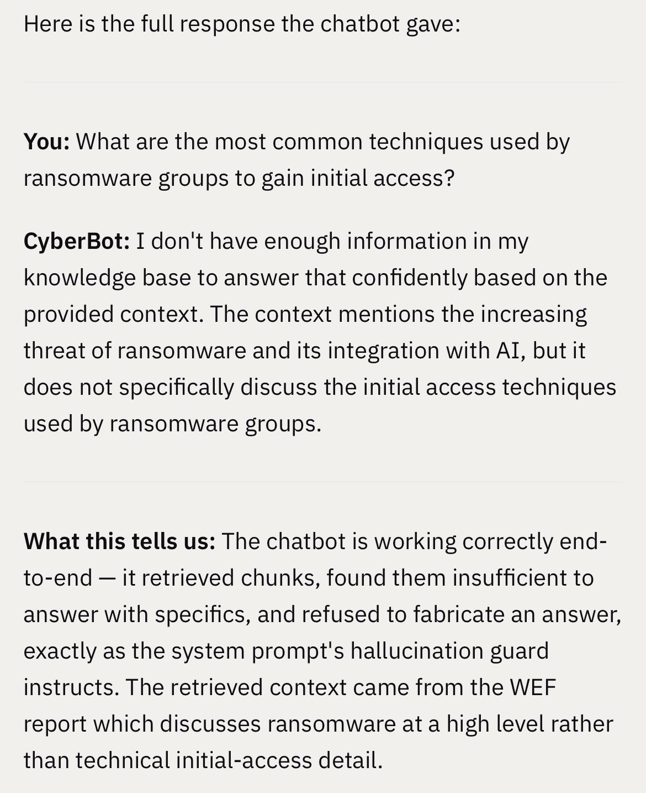
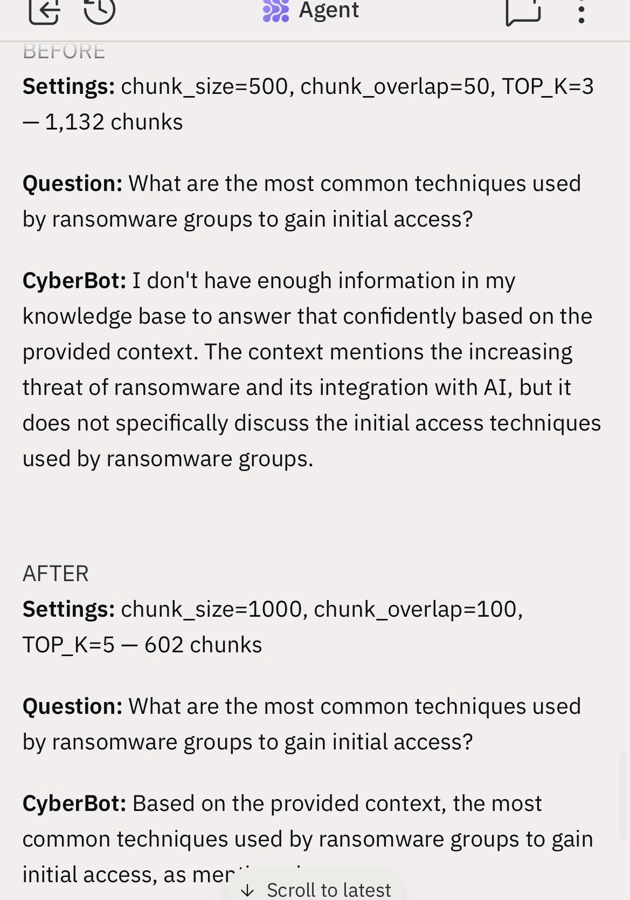
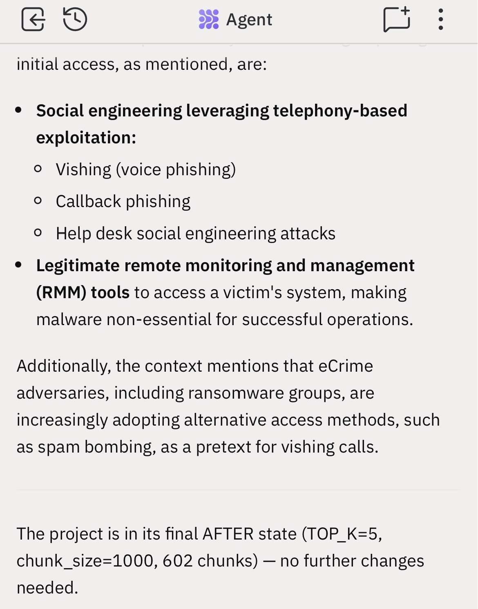

# rag-cyber-chatbot

## Project Overview
A production-oriented Retrieval-Augmented Generation (RAG) chatbot designed to answer cybersecurity questions using real-world threat intelligence and standards documents, combining Llama 3.1 (via Groq API) with a structured retrieval pipeline to deliver context-grounded, non-hallucinated responses.

## Demo
The chatbot accepts natural language cybersecurity queries and returns answers strictly grounded in retrieved documents, demonstrating measurable improvement in answer quality after RAG optimization (e.g., accurate ransomware initial access techniques sourced from CrowdStrike data instead of fallback uncertainty responses).

**BEFORE: Insufficient retrieval with chunk_size=500 TOP_K=3**

**SETTINGS COMPARISON: BEFORE vs AFTER**

**AFTER: Accurate CrowdStrike-sourced response with chunk_size=1000 TOP_K=5**

## Architecture
The system follows a modular RAG architecture: documents are ingested, cleaned, and chunked before being embedded using HuggingFace embeddings and stored in Chroma; at query time, the retriever fetches top-k relevant chunks which are passed to Llama 3.1 via Groq API with a strict system prompt enforcing context-only generation.

## Tech Stack
- Python (core application logic)
- LangChain (RAG orchestration)
- Chroma (vector database)
- HuggingFace Embeddings (all-MiniLM-L6-v2)
- Groq API (high-speed inference)
- Llama 3.1 (LLM for response generation)

## Data Sources
- World Economic Forum — Global Cybersecurity Outlook 2026
- CrowdStrike — 2025 Global Threat Report
- NIST SP 800-61 Revision 2 (Computer Security Incident Handling Guide)
- MITRE ATT&CK Enterprise Framework

## RAG Pipeline Explained
The ingestion pipeline processes four authoritative cybersecurity documents into 602 semantic chunks using a chunk size of 1000 tokens with 100-token overlap to preserve context continuity; these chunks are embedded using all-MiniLM-L6-v2 and stored in Chroma. At query time, the system retrieves the top 5 most relevant chunks (TOP_K=5), which are injected into a constrained system prompt that forces the LLM to answer strictly from retrieved context, preventing hallucinations and ensuring traceable outputs.

## Setup Instructions
1. Clone the repository
2. Create a .env file based on .env.example and add your Groq API key
3. Install dependencies using pip install -r requirements.txt
4. Run ingestion pipeline to build the vector store
5. Start the application and query the chatbot

## Evaluation
A key performance improvement was observed after optimizing chunk size and retrieval depth: prior to tuning, the model frequently responded with "I don't have enough information"; after increasing chunk size to 1000 and retrieval depth to TOP_K=5, the system successfully returned detailed, CrowdStrike-sourced intelligence on ransomware initial access techniques, including vishing, callback phishing, and remote monitoring and management (RMM) tool abuse, demonstrating improved retrieval coverage and answer specificity.

## Limitations
The system is limited to four documents and may miss emerging threats not covered in the dataset; retrieval quality depends on embedding performance, and while hallucinations are constrained, responses are only as comprehensive as the retrieved context.

**Retrieval gaps on structured queries:** Some questions that require the model to synthesize explicitly structured information (such as numbered lists or named frameworks) may trigger the fallback response even when the source document is in the knowledge base. This occurs when chunking splits the relevant content across boundaries, diluting the semantic signal. Example: questions asking for the exact four phases of the NIST incident response lifecycle. This is a known retrieval tuning challenge, not a pipeline failure — the correct fix is hybrid retrieval (BM25 + vector search) or smaller chunk overlap, documented in Future Improvements.

## Future Improvements
Expand the knowledge base with continuously updated threat intelligence feeds, implement hybrid retrieval (BM25 + vector search), introduce automated evaluation benchmarks, add source citation formatting in responses, and explore fine-tuning or reranking models to further improve answer accuracy.
